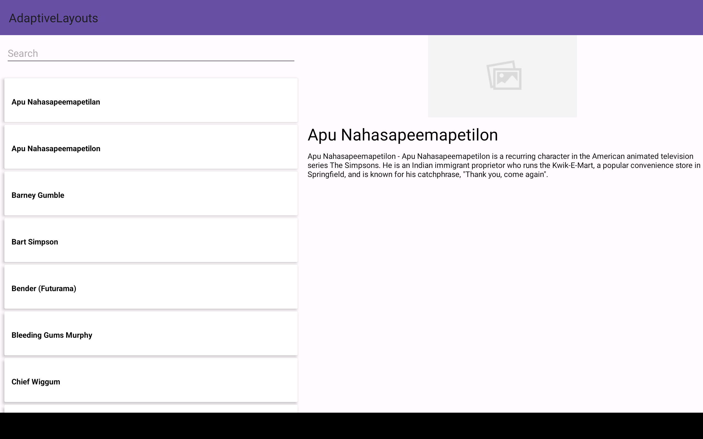

# Adaptive layouts

I have used
#### kotlin

### Project is build on:

- Android Studio Giraffe | 2022.3.1 Beta 3
- java 17

You must have newest Android Studio to run this Project

## Two productFlavors(for multiple apps)
- Production
- Staging
#### Description
- we can use different resource folder for different build flavor, for example if we want to use different color scheme, different launcher icon and many more

### Production
- applicationId = "com.example.adaptivelayouts"
- app_name = Adaptive Layouts
- API= http://api.duckduckgo.com/?q=simpsons+characters&format=json
### Staging
- applicationId = "com.example.adaptivelayouts.staging"
- app_name = Adaptive Layouts
- API= http://api.duckduckgo.com/?q=simpsons+characters&format=json

### Fragments
- Navigation component used for  Navigation.
- I have created One Fragment for showing  list.
- other fragment to show the detail

### Architecture(MVVM)
- MVVM used as Architecture
- i have used Dagger hilt as dependency injection.
- Retrofit for calling pai
### Tablet view
- For handling Tablet i have used SlidingPaneLayout which is google recommend
- [here](https://developer.android.com/develop/ui/views/layout/twopane) you can see the documentation 

